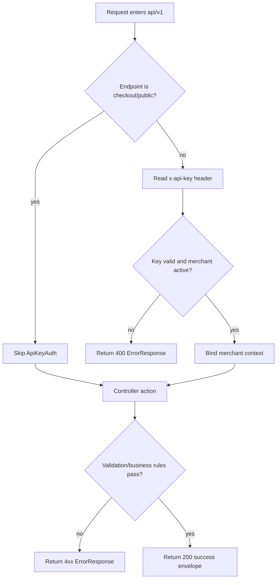
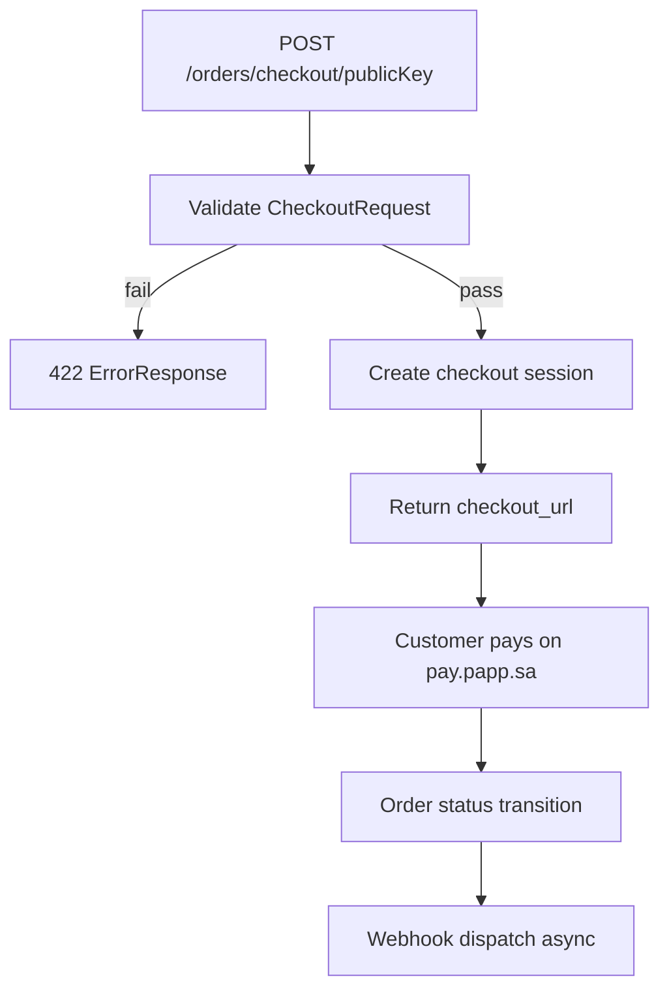
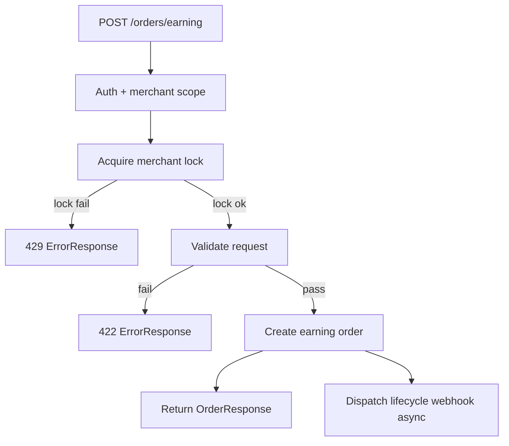
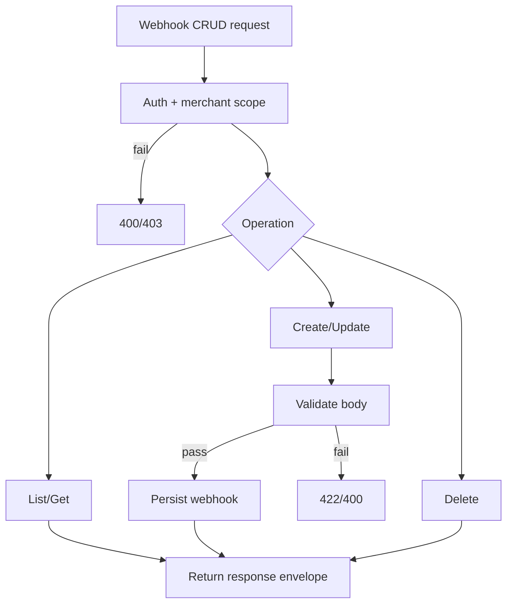
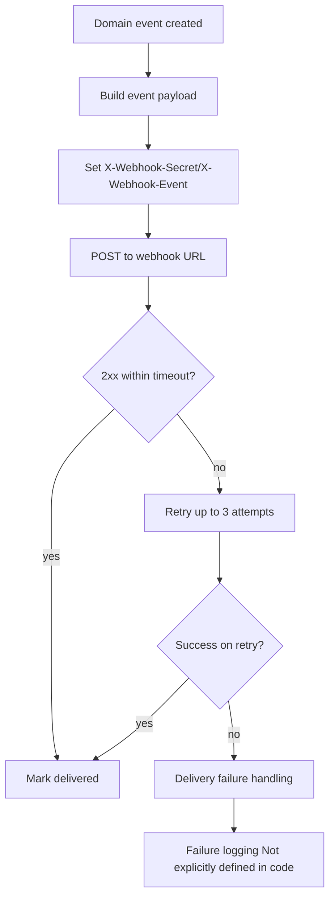

This page is a strict contract extraction from the currently available repository artifacts:

- `openapi/points-api-v1.yaml`
- existing docs pages under `integration/*` and `webhooks/*`

Backend Laravel source files requested as primary proof (`routes/api_v1.php`, controllers, middleware, FormRequests, Resources, enums, services, jobs, tests) are **not present in this workspace**.  
Where exact behavior cannot be verified from code, this document states:

`Not explicitly defined in code`

## 1. API Summary

| Item | Contract |
| --- | --- |
| Base URL | `https://api.papp.sa/api` (production), `http://localhost/api` (local) |
| Version prefix | `/v1` |
| Global middleware/auth | OpenAPI global security uses `ApiKeyAuth` (`x-api-key`) |
| Known auth exemption | `POST /v1/orders/checkout/{publicKey}` (`security: []`) |
| Content types (request) | `application/json` on body endpoints |
| Content types (response) | `application/json` |
| Date formatting | `date` (`YYYY-MM-DD`) and `date-time` (ISO 8601) appear in schemas |
| Number formatting | monetary fields are JSON `number` (`float`) |

## 2. Authentication Contract

| Item | Contract |
| --- | --- |
| Header name | `x-api-key` |
| Header location | HTTP request header |
| Missing/invalid key status | `400` (not `401`) |
| Missing/invalid key body | `ErrorResponse` envelope; exact message string is endpoint-dependent |
| Exempt endpoint(s) | `POST /v1/orders/checkout/{publicKey}` |
| Merchant scoping | Resources are scoped to authenticated merchant; cross-merchant access returns `404` in webhook docs |

Exact API key format (length/prefix/pattern): `Not explicitly defined in code`.

## 3. Global Envelope Definitions

### Success Envelope

| Field | Type | Required | Notes |
| --- | --- | --- | --- |
| `status` | boolean | yes | `true` in success examples |
| `message` | string \| null | yes | often empty string |
| `appended_data` | object | yes | free-form map |
| `data` | object/array | endpoint-specific | resource payload |

```json
{
  "status": true,
  "message": "",
  "appended_data": {},
  "data": {}
}
```

### Error Envelope

| Field | Type | Required | Notes |
| --- | --- | --- | --- |
| `status` | boolean | yes | `false` |
| `message` | string | yes | human-readable reason |
| `appended_data` | object | yes | extra details, shape varies |

```json
{
  "status": false,
  "message": "Invalid or inactive API key",
  "appended_data": {}
}
```

### Validation Error Envelope

OpenAPI reuses `ErrorResponse` for `422`. Structured field-error map:
`Not explicitly defined in code`.

### Resource Envelope

- Single resource: `ApiMetadata + data: <Resource>`
- Collection resource: `ApiMetadata + data: <Resource[]> + links + meta`

## 4. Endpoint-by-Endpoint Contract (Detailed)

Shared secured header (all except checkout):

| Header | Required | Type | Allowed values | Example | Notes |
| --- | --- | --- | --- | --- | --- |
| `x-api-key` | yes | string | Not explicitly defined in code | `pk_live_xxx` | Auth failure returns `400` |
| `Accept` | recommended | string | `application/json` | `application/json` | Not hard-required in spec |
| `Content-Type` | for body endpoints | string | `application/json` | `application/json` | Required when body sent |

### A. `POST /v1/orders/checkout/{publicKey}`

- Controller method: `Not explicitly defined in code`
- Auth required: no (`publicKey` path auth)
- Path params: `publicKey` (string, required)

Request body (`CheckoutRequest`):
- Required: `total_price`, `order_number`
- Optional: `phone_number`, `name`, `shipping_amount`, `tax_amount`, `discount_amount`, `shipping_address`, `products`, `metadata`, `callback_url`
- Key rules:
  - `total_price`: number, `>= 0`
  - `phone_number`: accepted forms documented; server normalizes to `5\d{8}`
  - `products`: nullable array, `minItems: 1` when present
  - `products[].quantity`: integer `>= 1`
  - `order_number`: leading `#` stripped server-side

Success `200`: `CheckoutResponse` with `data.checkout_url`.
Errors: `400`, `403`, `422`.

Minimal valid:
```json
{
  "total_price": 150.75,
  "order_number": "ORD-2024-0001"
}
```

Full valid:
```json
{
  "phone_number": "512345678",
  "name": "Ahmed Al-Saud",
  "total_price": 150.75,
  "shipping_amount": 15,
  "tax_amount": 22.5,
  "discount_amount": 10,
  "shipping_address": { "city": "Riyadh", "line1": "1234 King Fahd Rd, Al Olaya" },
  "products": [
    { "product_name": "Cappuccino", "product_price": 18.5, "quantity": 2 }
  ],
  "metadata": { "source": "mobile_app" },
  "order_number": "ORD-2024-0001",
  "callback_url": "https://merchant.example.com/callback"
}
```

Invalid examples:
1) missing `total_price`  
2) `products: []`  
3) `callback_url: "not-a-url"`  
Expected error details: `Not explicitly defined in code`.

### B. `GET /v1/orders/{orderUuid}`

- Path param: `orderUuid` (uuid string, required)
- Request body: none
- Success `200`: `OrderResponse`
- Errors: `400` (auth), `404` (not found)

### C. `POST /v1/orders/earning`

Request body (`EarningOrderRequest`):
- Required: `phone_number`, `total_price`, `products`, `order_number`
- Optional: `name`, `shipping_amount`, `tax_amount`, `discount_amount`, `shipping_address`, `metadata`
- Same numeric/item constraints as checkout

Responses:
- `200` success (`OrderResponse`)
- `400` auth
- `403` forbidden/business block
- `422` validation
- `429` lock/concurrency conflict

### D. `POST /v1/orders/{orderUuid}/complete`

Request body (`CompleteOrderRequest`) optional:
- `payment_method` optional nullable string enum: `"1"`..`"10"`

Responses:
- `200` success
- `400` business-rule failure
  - documented reasons include: `Order already fully paid`, `Only replacing orders can be completed`, `Order cannot be completed`, `Order is already completed`
- `404`, `422`

### E. `POST /v1/orders/{orderUuid}/authorize`

- Body: none
- `200` success
- `400` cannot authorize (example reason: already refunded)
- `404`

### F. `POST /v1/orders/{orderUuid}/capture`

- Body: none
- `200` success
- `400` cannot capture (example reason: already refunded)
- `404`

### G. `POST /v1/orders/{orderUuid}/cancel`

Body (`CancelRequest`) optional:
- `reason`: string, max 500
- default if omitted: `"Order cancelled via API"` (documented)

Responses:
- `200` success
- `400` business-rule failure
- `404`, `422`

### H. `POST /v1/orders/{orderUuid}/status`

Body (`ShippingStatusUpdateRequest`) required:
- `status` required enum:
  - `new`
  - `license_in_progress`
  - `ready_shipping`
  - `delivery_is_in_progress`
  - `delivered`
  - `cancelled`

Responses: `200`, `400`, `404`, `422`.

### I. `POST /v1/orders/{orderUuid}/refund`

Body (`RefundRequest`) optional:
- `amount`: number `>= 0` (omit for full refund)
- `reason`: string max 500

Responses:
- `200` success
- `400` refund not allowed (window/state/service checks)
- `404`, `422`

### J. `GET /v1/webhooks`

Query:
- `per_page`: integer, optional, minimum 1, default documented as 15

Responses:
- `200` `WebhookCollectionResponse`
- `400` auth

### K. `POST /v1/webhooks`

Body (`WebhookRequest`):
- required: `name` (string, max 255), `url` (uri, max 500)

Responses:
- `200` success
- `400` validation/duplicate url per merchant (as documented)
- `403`, `422`

### L. `GET /v1/webhooks/{webhookUuid}`

- Path param uuid
- `200`, `400`, `404`

### M. `PUT /v1/webhooks/{webhookUuid}`

Body (`WebhookUpdateRequest`):
- optional fields: `name`, `url`
- `minProperties: 1`

Responses: `200`, `403`, `404`, `422`

### N. `PATCH /v1/webhooks/{webhookUuid}`

Same body contract and responses as `PUT`.

### O. `DELETE /v1/webhooks/{webhookUuid}`

- Body: none
- Success `200` with `EmptyResponse`
- Errors: `403`, `404`

### P. Disabled / Planned endpoints

Products block under `routes/api_v1.php`: `Not explicitly defined in code`.

### Side Effects & Async (all endpoints)

| Area | Observed |
| --- | --- |
| DB writes/updates | implied by create/update/cancel/refund operations |
| Wallet/balance operations | implied for earning/redeem/refund flows |
| Notifications/webhook dispatch | documented for `cancelled`, `shipping_status_updated`, and other order events |
| Queued jobs | Not explicitly defined in code |
| Transactions/locks | lock behavior documented for `POST /v1/orders/earning` (429 path) |

### cURL quick examples

```bash
curl -X POST https://api.papp.sa/api/v1/orders/checkout/YOUR_PUBLIC_KEY -H "Content-Type: application/json" -d '{"total_price":150.75,"order_number":"ORD-1"}'
curl https://api.papp.sa/api/v1/orders/550e8400-e29b-41d4-a716-446655440000 -H "x-api-key: $POINTS_API_KEY"
curl -X POST https://api.papp.sa/api/v1/orders/earning -H "x-api-key: $POINTS_API_KEY" -H "Content-Type: application/json" -d '{"phone_number":"512345678","total_price":100,"products":[{"product_name":"Item","product_price":100,"quantity":1}],"order_number":"SALE-1"}'
curl -X POST https://api.papp.sa/api/v1/orders/550e8400-e29b-41d4-a716-446655440000/complete -H "x-api-key: $POINTS_API_KEY" -H "Content-Type: application/json" -d '{"payment_method":"2"}'
curl -X POST https://api.papp.sa/api/v1/orders/550e8400-e29b-41d4-a716-446655440000/authorize -H "x-api-key: $POINTS_API_KEY"
curl -X POST https://api.papp.sa/api/v1/orders/550e8400-e29b-41d4-a716-446655440000/capture -H "x-api-key: $POINTS_API_KEY"
curl -X POST https://api.papp.sa/api/v1/orders/550e8400-e29b-41d4-a716-446655440000/cancel -H "x-api-key: $POINTS_API_KEY" -H "Content-Type: application/json" -d '{"reason":"Customer requested cancellation"}'
curl -X POST https://api.papp.sa/api/v1/orders/550e8400-e29b-41d4-a716-446655440000/status -H "x-api-key: $POINTS_API_KEY" -H "Content-Type: application/json" -d '{"status":"ready_shipping"}'
curl -X POST https://api.papp.sa/api/v1/orders/550e8400-e29b-41d4-a716-446655440000/refund -H "x-api-key: $POINTS_API_KEY" -H "Content-Type: application/json" -d '{"amount":50,"reason":"Item returned"}'
curl https://api.papp.sa/api/v1/webhooks -H "x-api-key: $POINTS_API_KEY"
curl -X POST https://api.papp.sa/api/v1/webhooks -H "x-api-key: $POINTS_API_KEY" -H "Content-Type: application/json" -d '{"name":"Order Notifications","url":"https://merchant.example.com/webhooks/points"}'
curl https://api.papp.sa/api/v1/webhooks/550e8400-e29b-41d4-a716-446655440000 -H "x-api-key: $POINTS_API_KEY"
curl -X PUT https://api.papp.sa/api/v1/webhooks/550e8400-e29b-41d4-a716-446655440000 -H "x-api-key: $POINTS_API_KEY" -H "Content-Type: application/json" -d '{"name":"Updated Name"}'
curl -X PATCH https://api.papp.sa/api/v1/webhooks/550e8400-e29b-41d4-a716-446655440000 -H "x-api-key: $POINTS_API_KEY" -H "Content-Type: application/json" -d '{"url":"https://merchant.example.com/webhooks/new"}'
curl -X DELETE https://api.papp.sa/api/v1/webhooks/550e8400-e29b-41d4-a716-446655440000 -H "x-api-key: $POINTS_API_KEY"
```

## 5. Enum Contracts

### Confirmed in current docs/spec

| Enum | Values | API-visible usage |
| --- | --- | --- |
| Shipping status | `new`, `license_in_progress`, `ready_shipping`, `delivery_is_in_progress`, `delivered`, `cancelled` | request body `POST /orders/{uuid}/status`, webhook payload docs |
| Payment method | `"1"`..`"10"` | request body `POST /orders/{uuid}/complete` |
| Order status | `new`, `approved`, `authorized`, `captured`, `cancelled`, `fully_refunded`, `partially_refunded` | `OrderResponse`, webhook docs |
| Order type | numeric `1`,`2`; docs also mention string `earning`,`replacing` | `OrderResponse` + webhook docs |

### Laravel enum classes requested

- `OrderType`, `OrderStatus`, `OrderShippingStatus`, `OrderSettlementStatus`:  
  backed values/constants and source mapping = `Not explicitly defined in code`.

## 6. Webhook Delivery Contracts

### Webhook CRUD API

- Covered by endpoints `GET/POST /v1/webhooks`, `GET/PUT/PATCH/DELETE /v1/webhooks/{webhookUuid}`
- Payload schemas: `WebhookRequest`, `WebhookUpdateRequest`, `WebhookResponse`, `WebhookCollectionResponse`

### Outbound event envelope

```json
{
  "event": "approved",
  "order": {},
  "timestamp": "2026-04-18T10:05:12Z"
}
```

Known event names in docs:
- `approved`, `authorized`, `captured`, `cancelled`, `completed`, `shipping_status_updated`, `refunded`, `auto_refunded`

Headers documented for delivery:
- `Content-Type: application/json`
- `X-Webhook-Secret`
- `X-Webhook-Event`

Timeout/retries:
- timeout `10` seconds
- retries up to `3`

Failure logging behavior:
- `Not explicitly defined in code`.

Idempotency:
- docs explicitly advise idempotent consumers.

## 7. Status Code Matrix

| Endpoint | Statuses |
| --- | --- |
| `POST /v1/orders/checkout/{publicKey}` | `200,400,403,422` |
| `GET /v1/orders/{orderUuid}` | `200,400,404` |
| `POST /v1/orders/earning` | `200,400,403,422,429` |
| `POST /v1/orders/{orderUuid}/complete` | `200,400,404,422` |
| `POST /v1/orders/{orderUuid}/authorize` | `200,400,404` |
| `POST /v1/orders/{orderUuid}/capture` | `200,400,404` |
| `POST /v1/orders/{orderUuid}/cancel` | `200,400,404,422` |
| `POST /v1/orders/{orderUuid}/status` | `200,400,404,422` |
| `POST /v1/orders/{orderUuid}/refund` | `200,400,404,422` |
| `GET /v1/webhooks` | `200,400` |
| `POST /v1/webhooks` | `200,400,403,422` |
| `GET /v1/webhooks/{webhookUuid}` | `200,400,404` |
| `PUT /v1/webhooks/{webhookUuid}` | `200,403,404,422` |
| `PATCH /v1/webhooks/{webhookUuid}` | `200,403,404,422` |
| `DELETE /v1/webhooks/{webhookUuid}` | `200,403,404` |

## 8. Flowcharts (Mermaid)

### API key middleware flow


### Order checkout flow


### Earning order creation flow


### Order completion flow
```mermaid
flowchart TD
  A[POST /orders/{uuid}/complete] --> B[Auth + bind order]
  B -->|not found| C[404 ErrorResponse]
  B --> D[Validate payment_method if provided]
  D -->|fail| E[422 ErrorResponse]
  D -->|pass| F{Business-rule checks}
  F -- fail --> G[400 ErrorResponse]
  F -- pass --> H[Mark approved/completed]
  H --> I[Return OrderResponse]
  H --> J[Dispatch completed webhook async]
```

### Refund flow
```mermaid
flowchart TD
  A[POST /orders/{uuid}/refund] --> B[Auth + bind order]
  B -->|not found| C[404 ErrorResponse]
  B --> D[Validate amount/reason]
  D -->|fail| E[422 ErrorResponse]
  D -->|pass| F[RefundService business checks]
  F -->|not allowed| G[400 ErrorResponse]
  F -->|allowed| H[Apply full/partial refund]
  H --> I[Return OrderResponse]
  H --> J[Dispatch refunded webhook async]
```

### Webhook CRUD flow


### Outbound webhook dispatch flow


## 9. Contract Gaps & Risks

1. **Primary source missing**: Laravel route/controller/request/resource/test files are unavailable in this repo.
2. **Webhook payload vs API resource mismatch**:
   - API resource uses `id` integer + `uuid`.
   - webhook docs often show `id` as UUID string.
3. **Type mismatch risk**:
   - order `type` appears numeric in API resource but string (`earning/replacing`) in webhook docs.
4. **Validation error shape not explicit**:
   - `422` reuses generic `ErrorResponse`; field-level error map not defined.
5. **Exact error message contracts incomplete**:
   - only partial examples/descriptions exist.
6. **“Observed in controller” vs “Asserted in tests” cannot be produced yet**:
   - tests not present.

## 10. OpenAPI 3.0 YAML (Detailed)

Current canonical YAML already exists at:

- `openapi/points-api-v1.yaml`

Coverage status against your requested detailed OAS:

| Requirement | Current status |
| --- | --- |
| Per-endpoint request bodies | present |
| Per-endpoint responses | present |
| Reusable error schema | present (`ErrorResponse`) |
| Enums | partially present |
| Response variants/examples per scenario | partial |
| Exact validation details from FormRequests | Not explicitly defined in code |
| Controller/test divergence annotations | Not explicitly defined in code |

Recommended next patch once backend code is provided:
- enrich `422` schema with field error maps,
- add explicit `examples` per response status and scenario,
- align `OrderResource` and webhook event order object types,
- add operation-level `x-source` extension referencing controller + test method names.
