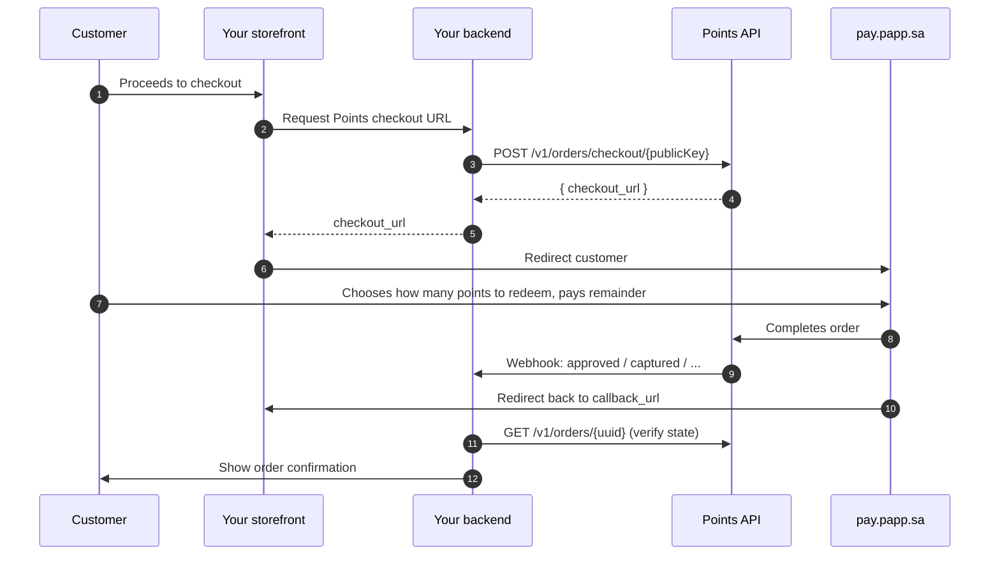

The Checkout flow lets your customers **redeem Points** during your checkout for a direct discount on the order, and **earn Points** on whatever portion they pay in cash. It is the full Points experience — the right choice when you want customers to feel they can spend the balance they've built up across the network.

If you only need to award points on completed purchases, see the simpler [Earn-only](/integration/earn-only) flow.

## High-level picture



## Prerequisites

- **Public key** (for creating the checkout session) — see [API keys](/authentication/api-keys)
- **Private key** (for the post-redirect verification call)
- **Webhook endpoint** — registered in the dashboard, receives order events ([Webhooks overview](/webhooks/overview))
- **Callback URL** — a page on your storefront where Points redirects the customer after checkout completes

## Step 1 — Create the checkout session

When the customer clicks **Pay** on your checkout page, your backend calls the public checkout endpoint with the Public key in the URL.

```bash
curl -X POST https://api.papp.sa/api/v1/orders/checkout/YOUR_PUBLIC_KEY \
  -H "Content-Type: application/json" \
  -H "Accept: application/json" \
  -d '{
    "phone_number": "512345678",
    "total_price": 150.75,
    "order_number": "ORD-2024-0001",
    "callback_url": "https://merchant.example.com/checkout/callback?order=ORD-2024-0001",
    "products": [
      { "product_name": "Cappuccino", "product_price": 18.50, "quantity": 2 },
      { "product_name": "Croissant",  "product_price": 39.00, "quantity": 2 }
    ],
    "metadata": { "source": "web", "cart_id": "cart_abc123" }
  }'
```

<Note>
  The Checkout endpoint does **not** require the `x-api-key` header — the Public key in the URL is sufficient. Do not include the Private key on this call.
</Note>

### Response

```json
{
  "status": true,
  "message": "",
  "appended_data": {},
  "data": {
    "checkout_url": "https://pay.papp.sa/session/abcd1234"
  }
}
```

## Step 2 — Redirect the customer

Redirect the customer's browser to `checkout_url`. They will:

1. Confirm their phone number (one-time OTP if not yet verified).
2. See their redeemable Points balance.
3. Choose how many points to apply as discount.
4. Pay the remaining amount via your configured PSP.

## Step 3 — Receive the webhook

As soon as Points settles the checkout, your registered webhook endpoint receives the terminal event. The most common sequence is:

| Event | Meaning |
| --- | --- |
| `approved` | Checkout completed and payment confirmed. Points redeemed + earned. |
| `captured` | Funds captured (if you use an authorize-then-capture PSP). |
| `cancelled` | Customer abandoned the checkout or payment failed. |

See [Webhook events](/webhooks/events) for full payload schemas.

```json
{
  "event": "approved",
  "order": {
    "id": "550e8400-e29b-41d4-a716-446655440000",
    "reference_number": "REF-2024-001234",
    "order_number": "ORD-2024-0001",
    "type": "replacing",
    "total_price": 150.75,
    "total_points": 500,
    "payment_status": "fully_paid",
    "order_status": "approved",
    "metadata": { "source": "web", "cart_id": "cart_abc123" },
    "created_at": "2026-04-18T10:00:00Z",
    "updated_at": "2026-04-18T10:05:12Z"
  },
  "timestamp": "2026-04-18T10:05:12Z"
}
```

<Warning>
  Treat the webhook — not the `callback_url` landing — as the source of truth. The customer may close the browser before redirect, but the webhook still fires.
</Warning>

## Step 4 — Handle the browser redirect

Points redirects the customer's browser to the `callback_url` you supplied. The URL is appended with query parameters identifying the order so your frontend can show the right confirmation page.

Your callback handler should:

1. Look up the order in your database by `order_number`.
2. If the webhook hasn't landed yet, call `GET /v1/orders/{uuid}` to confirm state before showing success.
3. Display the appropriate confirmation (or failure) page.

```bash
curl https://api.papp.sa/api/v1/orders/550e8400-e29b-41d4-a716-446655440000 \
  -H "x-api-key: $POINTS_API_KEY" \
  -H "Accept: application/json"
```

## Step 5 — Fulfilment & shipping updates (optional)

For physical-goods orders, as you fulfil the order you can update the shipping status so Points reflects the right state on the customer's transaction history:

```bash
curl -X POST https://api.papp.sa/api/v1/orders/{uuid}/status \
  -H "x-api-key: $POINTS_API_KEY" \
  -H "Content-Type: application/json" \
  -d '{ "status": "ready_shipping" }'
```

Allowed values: `new`, `license_in_progress`, `ready_shipping`, `delivery_is_in_progress`, `delivered`, `cancelled`.

Each call fires a `shipping_status_updated` webhook.

## Refunds & cancellations

See the dedicated page: [Refunds & cancellations](/integration/refunds-cancellations).

## Edge cases

<AccordionGroup>
  <Accordion title="Customer closes browser before redirect">
    The webhook still fires. Use it as your source of truth. Your callback-handler page should be resilient to a missing query parameter — fall back to querying the order by `order_number`.
  </Accordion>
  <Accordion title="Customer reloads the Points checkout page">
    The session remains valid until it expires or is completed. A stale `checkout_url` returns a friendly error page from Points.
  </Accordion>
  <Accordion title="Webhook arrives before browser redirect">
    Common. Your database should be updated by the webhook handler; the callback page reads from the database, not from query params.
  </Accordion>
  <Accordion title="Order amount changes after checkout started">
    Cancel the existing checkout session (the customer can retry) and create a new one with the updated amount. Do **not** mutate an already-approved order — refund/re-charge instead.
  </Accordion>
</AccordionGroup>

## What's next

<CardGroup cols={2}>
  <Card title="Order lifecycle" icon="timeline" href="/integration/order-lifecycle">
    Understand state transitions (authorize → capture → refund).
  </Card>
  <Card title="Webhooks overview" icon="bell" href="/webhooks/overview">
    Receive and process real-time order events.
  </Card>
  <Card title="Refunds & cancellations" icon="rotate-left" href="/integration/refunds-cancellations">
    Full and partial refunds, cancellation windows.
  </Card>
  <Card title="Go-live checklist" icon="check-double" href="/testing/go-live-checklist">
    Everything to verify before production traffic.
  </Card>
</CardGroup>
