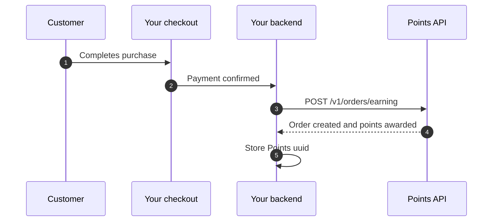

Earn-only is the fastest way to launch Points. Your customer completes checkout in **your own system**, and once the purchase is confirmed your backend calls Points to award loyalty points.

This flow has:

- no redirect to Points checkout
- no customer-facing UI changes
- one primary API call: `POST /v1/orders/earning`

If you want customers to spend points during checkout, use [Checkout flow](/integration/checkout-flow) instead.

## When to choose Earn-only

Use this flow if:

- you want to launch quickly
- your current checkout should remain unchanged
- you only need to award points after purchase
- you can add one server-to-server API call after payment succeeds

## Flow overview



## Required inputs

Every earning request should include:

| Field | Required | Notes |
| --- | --- | --- |
| `phone_number` | Yes | KSA mobile format |
| `total_price` | Yes | Total paid amount in SAR |
| `order_number` | Yes | Your merchant-side unique order reference |
| `products` | Yes | Array with at least one item |
| `metadata` | No | Useful for cart, channel, branch, or POS context |

## Example request

```bash
curl -X POST https://api.papp.sa/api/v1/orders/earning \
  -H "x-api-key: $POINTS_API_KEY" \
  -H "Content-Type: application/json" \
  -H "Accept: application/json" \
  -d '{
    "phone_number": "512345678",
    "total_price": 115.00,
    "order_number": "SALE-2026-0021",
    "products": [
      { "product_name": "Cappuccino", "product_price": 18.50, "quantity": 2 },
      { "product_name": "Croissant", "product_price": 39.00, "quantity": 2 }
    ],
    "metadata": {
      "channel": "web",
      "branch_code": "RUH-01"
    }
  }'
```

## Successful response

```json
{
  "status": true,
  "message": "",
  "appended_data": {},
  "data": {
    "id": 42,
    "uuid": "550e8400-e29b-41d4-a716-446655440000",
    "reference_number": "REF-2026-001234",
    "order_status": "approved",
    "order_number": "SALE-2026-0021",
    "type": 1,
    "total_price": 115.0,
    "total_points": 2300,
    "metadata": {
      "channel": "web",
      "branch_code": "RUH-01"
    },
    "created_at": "2026-04-18T10:00:00Z"
  }
}
```

Store the returned `uuid`. You will need it later for:

- refunds
- lookups
- reconciliation

## Important runtime behavior

### If the customer is not yet fully engaged

The backend supports a pending earning flow for customers who exist but have not completed app engagement yet. That means an earning attempt may not behave exactly like a normal approved order in every edge case. Your system should always inspect the returned response instead of assuming one fixed downstream state.

### Concurrency

Earning requests are serialized per merchant through a distributed lock. If you send too many concurrent requests for the same merchant, the API may return `429`.

Practical advice:

- do not parallelize multiple earning calls for the same merchant
- retry with a short back-off if you receive `429`

### Deduplication

Use a unique `order_number` from your system. Even when the API accepts the request, your own system should still treat `order_number` as the source of truth for idempotent retries.

## When to call the API

Call `POST /orders/earning` only after the purchase is actually confirmed in your own system, such as:

- successful PSP callback
- order marked paid in POS
- COD order marked collected

Do not call it before payment confirmation.

## Recommended reconciliation

1. Create the earning order after your payment succeeds.
2. Store the returned `uuid`.
3. If your worker crashes after the call, use your stored `order_number` and internal audit log to detect the partially completed step.
4. For disputes or support, fetch the order later with `GET /v1/orders/{uuid}`.

## Common errors

| HTTP status | Meaning | What to do |
| --- | --- | --- |
| `400` | Missing or invalid API key | Verify `x-api-key` and environment |
| `403` | Merchant not verified/published or earn flow disabled | Contact Points support / account manager |
| `422` | Validation error | Check `phone_number`, `products`, `total_price`, `order_number` |
| `429` | Concurrent earning requests for the same merchant | Retry with back-off |

## Next

<CardGroup cols={2}>
  <Card title="Quick start" icon="rocket" href="/introduction/quickstart">
    Full first-call walkthrough with examples.
  </Card>
  <Card title="Refunds & Cancellations" icon="rotate-left" href="/integration/refunds-cancellations">
    What happens if an already-awarded order is later refunded.
  </Card>
  <Card title="Go-Live Checklist" icon="check-double" href="/testing/go-live-checklist">
    Verify your production readiness before launch.
  </Card>
</CardGroup>
