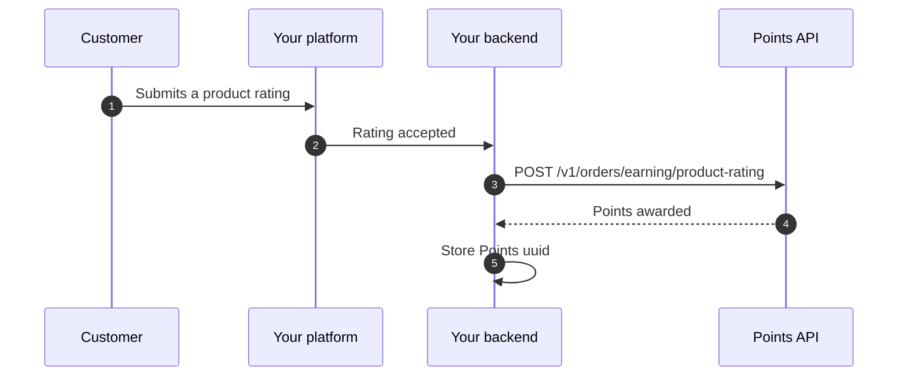

Award points to a customer whenever they submit a rating for a product they purchased. The points amount is a flat value configured by the merchant in the Points dashboard — your integration only reports the event and identifies the product.

This channel is independent of [Earn on orders](/integration/earn-only) and [Earn on store rating](/integration/earn-store-rating).

## When to choose this channel

Use this channel if:

- you collect per-product reviews on your platform
- you want to reward customers for reviewing each product separately
- you want a different earning event than store-level ratings

## Flow overview



## Required inputs

| Field | Required | Notes |
| --- | --- | --- |
| `phone_number` | Yes | KSA mobile, normalised server-side to `5XXXXXXXX` |
| `review_reference` | Yes | Your platform's unique identifier for this rating — used for idempotency |
| `product_id` | Yes | Your platform's product identifier (SKU or internal ID) |
| `product_name` | No | Human-readable product name. Stored for audit |
| `rating` | No | Star value (1–5). Stored for audit only — does not change the points awarded |
| `comment` | No | Free-text review body. Stored for audit only |
| `metadata` | No | Free-form object for channel, branch, source, etc. |

<Note>
The merchant configures the **points amount** in the Points dashboard under *Earning methods → Product rating*. Your request body does **not** carry the points value.
</Note>

## Example request

```bash
curl -X POST https://business.papp.sa/api/v1/orders/earning/product-rating \
  -H "x-api-key: $POINTS_API_KEY" \
  -H "Content-Type: application/json" \
  -H "Accept: application/json" \
  -d '{
    "phone_number": "512345678",
    "review_reference": "PRODUCT-REVIEW-2026-0001",
    "product_id": "SKU-CAPPUCCINO-250G",
    "product_name": "Cappuccino 250g",
    "rating": 4,
    "comment": "Good aroma, smooth taste.",
    "metadata": {
      "channel": "mobile_app"
    }
  }'
```

## Successful response

```json
{
  "status": true,
  "message": "",
  "appended_data": {},
  "data": {
    "id": 91,
    "uuid": "1f2e3d4c-5b6a-7e8d-9c0b-1a2b3c4d5e6f",
    "reference_number": "REF-2026-002091",
    "order_status": "approved",
    "order_number": "PRODUCT-REVIEW-2026-0001",
    "type": 1,
    "total_price": 0,
    "total_points": 10,
    "metadata": {
      "channel": "mobile_app"
    },
    "created_at": "2026-04-18T10:00:00Z"
  }
}
```

Store the returned `uuid` for later lookups and reconciliation.

## When to call the API

Call the endpoint **only after the rating is accepted in your own system** — i.e. it has passed moderation, the customer is verified to have purchased the product, and the rating is not a draft. Do not call it for deleted or duplicate submissions.

If the customer edits or deletes their rating later, the awarded points are **not** automatically reversed.

## Important runtime behavior

### Pending customers

If the phone number does not yet belong to an active Points customer, the request returns a `pending_client_activation` payload. The reward is queued and credited when the customer activates their Points account.

```json
{
  "status": true,
  "message": "",
  "appended_data": {},
  "data": {
    "pending_client_activation": true,
    "pending_earning_order": {
      "id": 102,
      "merchant_order_number": "PRODUCT-REVIEW-2026-0001",
      "total_price": 0,
      "total_points": 10
    }
  }
}
```

### Concurrency

Earning requests are serialized per merchant through a distributed lock. Do not parallelize earning calls for the same merchant; retry `429` with a short back-off.

### Deduplication

Use a stable, unique `review_reference` per rating. Re-sending the same `review_reference` for the same merchant is treated as a duplicate and rejected — safe to retry without double-awarding.

## Common errors

| HTTP status | Meaning | What to do |
| --- | --- | --- |
| `400` | Missing or invalid API key | Verify `x-api-key` and environment |
| `403` | Merchant unverified/unpublished or product-rating earning disabled | Ask the merchant to enable the channel in the dashboard |
| `422` | Validation error | Check `phone_number`, `review_reference`, and `product_id` |
| `429` | Concurrent earning requests for the same merchant | Retry with back-off |

## Next

<CardGroup cols={2}>
  <Card title="Earn on store rating" icon="star" href="/integration/earn-store-rating">
    Award points for an overall store rating.
  </Card>
  <Card title="All earning methods" icon="list" href="/integration/earning-methods">
    Compare the three earning channels side by side.
  </Card>
</CardGroup>
