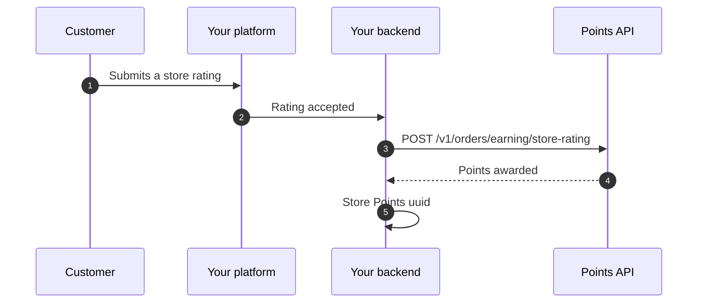

Award points to a customer whenever they submit a rating for your store. The points amount is a flat value configured by the merchant in the Points dashboard — your integration only reports the event.

This channel is independent of [Earn on orders](/integration/earn-only). You can enable both, only this one, or only orders.

## When to choose this channel

Use this channel if:

- you collect store-level ratings or reviews on your platform
- you want to reward customers for engagement, not only for purchases
- the merchant wants a fixed points reward per store rating (independent of order size)

## Flow overview



## Required inputs

| Field | Required | Notes |
| --- | --- | --- |
| `phone_number` | Yes | KSA mobile, normalised server-side to `5XXXXXXXX` |
| `review_reference` | Yes | Your platform's unique identifier for this rating — used for idempotency |
| `rating` | No | Star value (1–5). Stored for audit only — does not change the points awarded |
| `comment` | No | Free-text review body. Stored for audit only |
| `metadata` | No | Free-form object for channel, branch, source, etc. |

<Note>
The merchant configures the **points amount** in the Points dashboard under *Earning methods → Store rating*. Your request body does **not** carry the points value.
</Note>

## Example request

```bash
curl -X POST https://business.papp.sa/api/v1/orders/earning/store-rating \
  -H "x-api-key: $POINTS_API_KEY" \
  -H "Content-Type: application/json" \
  -H "Accept: application/json" \
  -d '{
    "phone_number": "512345678",
    "review_reference": "STORE-REVIEW-2026-0001",
    "rating": 5,
    "comment": "Great experience, fast delivery.",
    "metadata": {
      "channel": "web",
      "branch_code": "RUH-01"
    }
  }'
```

## Successful response

```json
{
  "status": true,
  "message": "",
  "appended_data": {},
  "data": {
    "id": 88,
    "uuid": "9c4b1d2e-7f8a-4b3c-9e2d-1a2b3c4d5e6f",
    "reference_number": "REF-2026-002088",
    "order_status": "approved",
    "order_number": "STORE-REVIEW-2026-0001",
    "type": 1,
    "total_price": 0,
    "total_points": 25,
    "metadata": {
      "channel": "web",
      "branch_code": "RUH-01"
    },
    "created_at": "2026-04-18T10:00:00Z"
  }
}
```

The response shape matches an earning order so you can store the `uuid` and reconcile the same way you do for purchase-based earning.

## When to call the API

Call the endpoint **only after the rating is accepted in your own system** — i.e. it has passed your moderation, spam checks, or any minimum-content rules. Do not call it for drafts, deleted reviews, or duplicate submissions.

If the customer edits or deletes their rating later, the awarded points are **not** automatically reversed. Treat the API call as a one-shot reward at submission time.

## Important runtime behavior

### Pending customers

If the phone number does not yet belong to an active Points customer, the request returns a `pending_client_activation` payload. The reward is queued and credited when the customer activates their Points account.

```json
{
  "status": true,
  "message": "",
  "appended_data": {},
  "data": {
    "pending_client_activation": true,
    "pending_earning_order": {
      "id": 99,
      "merchant_order_number": "STORE-REVIEW-2026-0001",
      "total_price": 0,
      "total_points": 25
    }
  }
}
```

### Concurrency

Earning requests are serialized per merchant through a distributed lock. Do not parallelize earning calls for the same merchant; retry `429` with a short back-off.

### Deduplication

Use a stable, unique `review_reference` per rating. Re-sending the same `review_reference` for the same merchant is treated as a duplicate and rejected — safe to retry without double-awarding.

## Common errors

| HTTP status | Meaning | What to do |
| --- | --- | --- |
| `400` | Missing or invalid API key | Verify `x-api-key` and environment |
| `403` | Merchant unverified/unpublished or store-rating earning disabled | Ask the merchant to enable the channel in the dashboard |
| `422` | Validation error | Check `phone_number` and `review_reference` |
| `429` | Concurrent earning requests for the same merchant | Retry with back-off |

## Next

<CardGroup cols={2}>
  <Card title="Earn on product rating" icon="comment-dots" href="/integration/earn-product-rating">
    Award points for ratings on a specific product.
  </Card>
  <Card title="All earning methods" icon="list" href="/integration/earning-methods">
    Compare the three earning channels side by side.
  </Card>
</CardGroup>
