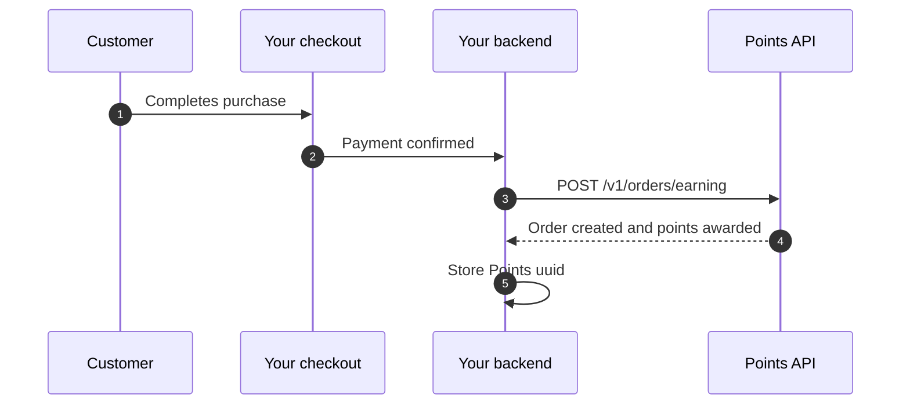
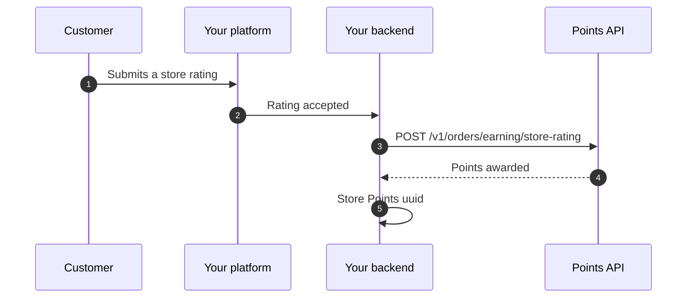
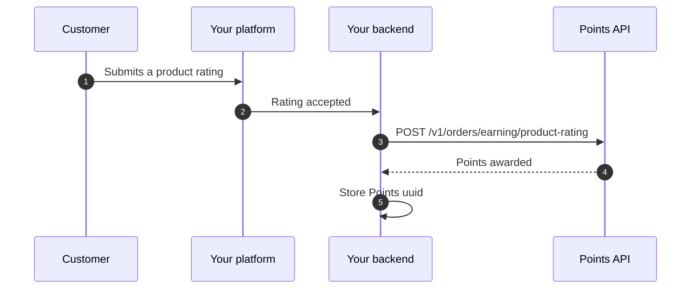

Points supports **three independent earning channels**. You can integrate one, two, or all three — each channel is opt-in and shares the same API key, lock, response shape, and pending-customer handling.

| Channel | Trigger | Endpoint |
| --- | --- | --- |
| [Order purchase](#order-purchase) | Customer completes a purchase | `POST /v1/orders/earning` |
| [Store rating](#store-rating) | Customer rates your store | `POST /v1/orders/earning/store-rating` |
| [Product rating](#product-rating) | Customer rates a product | `POST /v1/orders/earning/product-rating` |

## How earning amounts are decided

The **merchant controls the points amount**, not the API caller. Each channel reads its configured rate from the merchant's Points dashboard:

- **Order purchase** — points scale with `total_price` and a per-merchant multiplier. Specific products can be assigned a custom point value that overrides the default.
- **Store rating** — flat amount per accepted store rating.
- **Product rating** — flat amount per accepted product rating.

This means your integration code never decides how many points are awarded. You only tell Points *what happened*, and Points applies the merchant's current configuration.

<Note>
A channel must be **enabled and funded** in the merchant's dashboard before its endpoint will award points. If the channel is disabled, the API returns `403`.
</Note>

## Shared behavior across all channels

All three earning endpoints share these guarantees so your integration logic stays uniform:

- **Authentication.** Same `x-api-key` header (see [API keys](/authentication/api-keys)).
- **Concurrency.** Each merchant is serialized through a distributed lock. Send earning calls sequentially per merchant; retry `429` with a short back-off.
- **Idempotency.** Each request carries a merchant-side unique reference (`order_number` for purchases, `review_reference` for ratings). Reuse the same reference on retries — duplicates are rejected, not double-awarded.
- **Pending customers.** If the customer's Points account is not yet activated, the response returns a `pending_client_activation` payload instead of an approved order. The earning is queued and finalized when the customer activates.
- **Response shape.** Same `data.uuid`, `data.reference_number`, `data.order_status`, and `data.total_points` fields. Store the `uuid` for later lookups, refunds, and reconciliation.

### Pending-customer response (any channel)

```json
{
  "status": true,
  "message": "",
  "appended_data": {},
  "data": {
    "pending_client_activation": true,
    "pending_earning_order": {
      "id": 99,
      "merchant_order_number": "SALE-2026-0021",
      "total_price": 115.0,
      "total_points": 1150
    }
  }
}
```

---

## Order purchase

Award points to a customer for a completed purchase. This is the most common channel — use it when your checkout system runs entirely on your side and you want to reward the payment.

### Flow



### Required inputs

| Field | Required | Notes |
| --- | --- | --- |
| `phone_number` | Yes | KSA mobile, normalised server-side to `5XXXXXXXX` |
| `total_price` | Yes | Total paid amount in SAR |
| `order_number` | Yes | Your merchant-side unique order reference |
| `products` | Yes | Array with at least one item |
| `metadata` | No | Useful for channel, branch, POS context |

### Example request

```bash
curl -X POST https://business.papp.sa/api/v1/orders/earning \
  -H "x-api-key: $POINTS_API_KEY" \
  -H "Content-Type: application/json" \
  -H "Accept: application/json" \
  -d '{
    "phone_number": "512345678",
    "total_price": 115.00,
    "order_number": "SALE-2026-0021",
    "products": [
      { "product_name": "Cappuccino", "product_price": 18.50, "quantity": 2 },
      { "product_name": "Croissant", "product_price": 39.00, "quantity": 2 }
    ],
    "metadata": {
      "channel": "web",
      "branch_code": "RUH-01"
    }
  }'
```

### Successful response

```json
{
  "status": true,
  "message": "",
  "appended_data": {},
  "data": {
    "id": 42,
    "uuid": "550e8400-e29b-41d4-a716-446655440000",
    "reference_number": "REF-2026-001234",
    "order_status": "approved",
    "order_number": "SALE-2026-0021",
    "type": 1,
    "total_price": 115.0,
    "total_points": 2300,
    "metadata": {
      "channel": "web",
      "branch_code": "RUH-01"
    },
    "created_at": "2026-04-18T10:00:00Z"
  }
}
```

### When to call the API

Call `POST /v1/orders/earning` only **after** the purchase is actually confirmed in your own system, such as:

- successful PSP callback
- order marked paid in POS
- COD order marked collected

Do not call it before payment confirmation.

---

## Store rating

Award points when a customer submits a rating for your store overall.

### Flow



### Required inputs

| Field | Required | Notes |
| --- | --- | --- |
| `phone_number` | Yes | KSA mobile, normalised server-side to `5XXXXXXXX` |
| `review_reference` | Yes | Your platform's unique identifier for this rating — used for idempotency |
| `rating` | No | Star value (1–5). Stored for audit only — does not change the points awarded |
| `comment` | No | Free-text review body. Stored for audit only |
| `metadata` | No | Free-form object for channel, branch, source, etc. |

<Note>
The merchant configures the **points amount** in the Points dashboard under *Earning methods → Store rating*. Your request body does **not** carry the points value.
</Note>

### Example request

```bash
curl -X POST https://business.papp.sa/api/v1/orders/earning/store-rating \
  -H "x-api-key: $POINTS_API_KEY" \
  -H "Content-Type: application/json" \
  -H "Accept: application/json" \
  -d '{
    "phone_number": "512345678",
    "review_reference": "STORE-REVIEW-2026-0001",
    "rating": 5,
    "comment": "Great experience, fast delivery.",
    "metadata": {
      "channel": "web",
      "branch_code": "RUH-01"
    }
  }'
```

### Successful response

```json
{
  "status": true,
  "message": "",
  "appended_data": {},
  "data": {
    "id": 88,
    "uuid": "9c4b1d2e-7f8a-4b3c-9e2d-1a2b3c4d5e6f",
    "reference_number": "REF-2026-002088",
    "order_status": "approved",
    "order_number": "STORE-REVIEW-2026-0001",
    "type": 1,
    "total_price": 0,
    "total_points": 25,
    "created_at": "2026-04-18T10:00:00Z"
  }
}
```

### When to call the API

Call the endpoint **only after the rating is accepted in your own system** — i.e. it has passed moderation, spam checks, or any minimum-content rules. Do not call it for drafts, deleted reviews, or duplicate submissions.

If the customer edits or deletes their rating later, the awarded points are **not** automatically reversed. Treat the API call as a one-shot reward at submission time.

---

## Product rating

Award points when a customer submits a rating for a specific product they purchased.

### Flow



### Required inputs

| Field | Required | Notes |
| --- | --- | --- |
| `phone_number` | Yes | KSA mobile, normalised server-side to `5XXXXXXXX` |
| `review_reference` | Yes | Your platform's unique identifier for this rating — used for idempotency |
| `product_id` | Yes | Your platform's product identifier (SKU or internal ID) |
| `product_name` | No | Human-readable product name. Stored for audit |
| `rating` | No | Star value (1–5). Stored for audit only |
| `comment` | No | Free-text review body. Stored for audit only |
| `metadata` | No | Free-form object for channel, branch, source, etc. |

<Note>
The merchant configures the **points amount** in the Points dashboard under *Earning methods → Product rating*. Your request body does **not** carry the points value.
</Note>

### Example request

```bash
curl -X POST https://business.papp.sa/api/v1/orders/earning/product-rating \
  -H "x-api-key: $POINTS_API_KEY" \
  -H "Content-Type: application/json" \
  -H "Accept: application/json" \
  -d '{
    "phone_number": "512345678",
    "review_reference": "PRODUCT-REVIEW-2026-0001",
    "product_id": "SKU-CAPPUCCINO-250G",
    "product_name": "Cappuccino 250g",
    "rating": 4,
    "comment": "Good aroma, smooth taste.",
    "metadata": {
      "channel": "mobile_app"
    }
  }'
```

### Successful response

```json
{
  "status": true,
  "message": "",
  "appended_data": {},
  "data": {
    "id": 91,
    "uuid": "1f2e3d4c-5b6a-7e8d-9c0b-1a2b3c4d5e6f",
    "reference_number": "REF-2026-002091",
    "order_status": "approved",
    "order_number": "PRODUCT-REVIEW-2026-0001",
    "type": 1,
    "total_price": 0,
    "total_points": 10,
    "created_at": "2026-04-18T10:00:00Z"
  }
}
```

### When to call the API

Call the endpoint **only after the rating is accepted in your own system** — i.e. it has passed moderation, the customer is verified to have purchased the product, and the rating is not a draft. Do not call it for deleted or duplicate submissions.

If the customer edits or deletes their rating later, the awarded points are **not** automatically reversed.

---

## Common errors (all channels)

| HTTP status | Meaning | What to do |
| --- | --- | --- |
| `400` | Missing or invalid API key | Verify `x-api-key` and environment |
| `403` | Merchant unverified/unpublished or this earning channel disabled | Ask the merchant to enable the channel in the dashboard |
| `422` | Validation error | Check required fields for that channel |
| `429` | Concurrent earning requests for the same merchant | Retry with back-off |

## Recommended reconciliation

1. Create the earning record after the upstream event (payment / rating) is confirmed on your side.
2. Store the returned `uuid` against your own record.
3. If your worker crashes between the upstream event and the Points call, use your stored merchant reference (`order_number` or `review_reference`) to detect the partially completed step on retry.
4. For disputes or support, fetch the order later with `GET /v1/orders/{uuid}`.

## Next

<CardGroup cols={2}>
  <Card title="Quick start" icon="rocket" href="/introduction/quickstart">
    Make your first earning call end-to-end.
  </Card>
  <Card title="Refunds & cancellations" icon="rotate-left" href="/integration/refunds-cancellations">
    What happens when an awarded order is later refunded.
  </Card>
  <Card title="Order lifecycle" icon="timeline" href="/integration/order-lifecycle">
    State transitions, statuses, and webhooks.
  </Card>
  <Card title="Go-live checklist" icon="check-double" href="/testing/go-live-checklist">
    Verify production readiness before launch.
  </Card>
</CardGroup>
