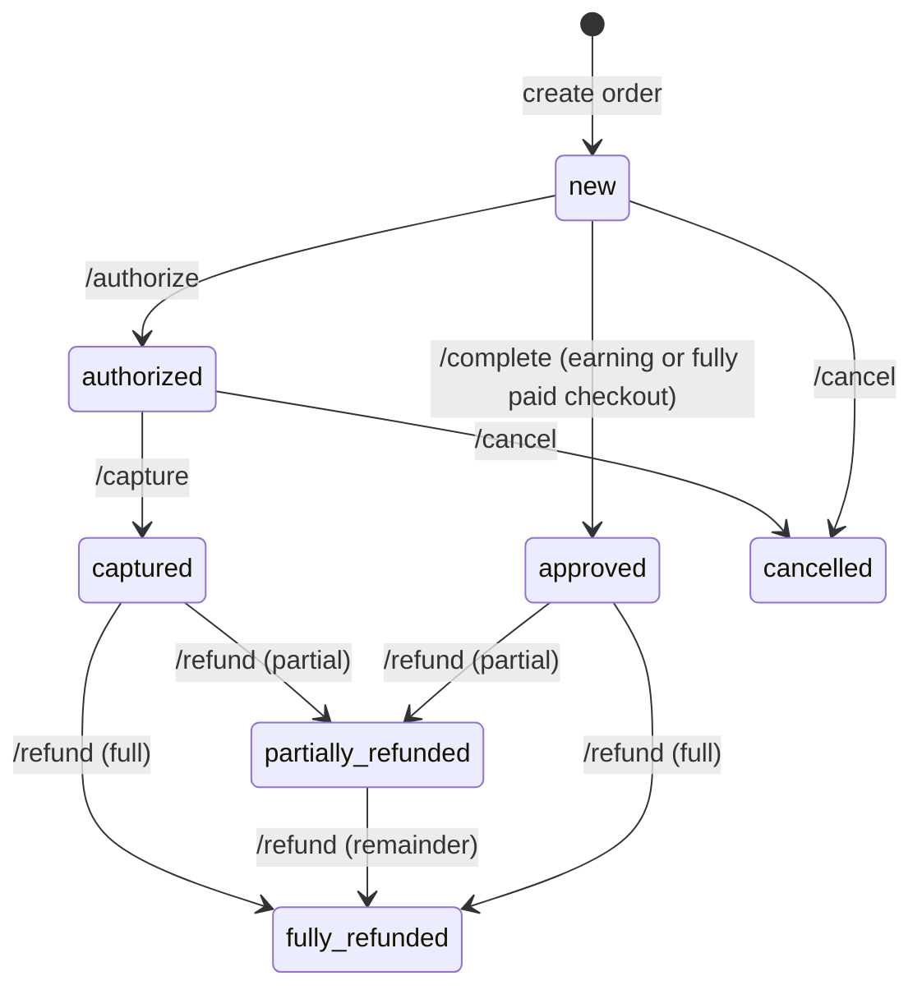

Every Points order moves through a small set of states, driven by either merchant API calls or internal Points events. Understanding the state machine is essential for building a correct refund/fulfilment/reconciliation pipeline.

## The state machine

## States explained

| `order_status` | Meaning | Typical trigger |
| --- | --- | --- |
| `new` | Order created, not yet settled. Customer may still be on checkout. | `POST /orders/checkout/{publicKey}` or `POST /orders/earning` (pre-lock release). |
| `approved` | Order settled. Points credited or redeemed. This is the happy-path terminal state for earning and fully-paid checkouts. | `POST /orders/{uuid}/complete` (after payment) or the earning path on `POST /orders/earning`. |
| `authorized` | Funds reserved but not captured. Used when your PSP runs a two-step auth→capture flow. | `POST /orders/{uuid}/authorize`. |
| `captured` | Authorized funds captured. Terminal state before any refund. | `POST /orders/{uuid}/capture`. |
| `cancelled` | Order cancelled. Any reserved points are released back to the customer. | `POST /orders/{uuid}/cancel`. |
| `fully_refunded` | Full amount refunded. All redeemed points returned; earned points reversed. | `POST /orders/{uuid}/refund` (no `amount`, or amount equals total). |
| `partially_refunded` | A portion of the order refunded. | `POST /orders/{uuid}/refund` with a partial `amount`. |

<Note>
  `order_status` is a string enum in every webhook payload. The OpenAPI spec reflects a legacy numeric field — prefer the string values above.
</Note>

## Two order types

| `type` (numeric) | `type` (webhook string) | Description |
| --- | --- | --- |
| `1` | `earning` | Single-step order created via `POST /orders/earning`. Awards points on a purchase the customer has already paid for on your side. |
| `2` | `replacing` | Full Points checkout — customer redeems + pays remainder on `business.papp.sa`. |

The state machine above applies to both, but earning orders typically move `new → approved` in a single step with no intermediate `authorized`/`captured`.

## Shipping status (separate field)

`order_status` tracks the **financial** state of the order. Physical-goods orders also have a separate **shipping status** that you update as you fulfil:

| Shipping status | Meaning |
| --- | --- |
| `new` | Order received, not yet processed. |
| `license_in_progress` | Paperwork / licensing in progress (where applicable). |
| `ready_shipping` | Packaged, handed to carrier. |
| `delivery_is_in_progress` | In transit. |
| `delivered` | Received by customer. |
| `cancelled` | Shipping cancelled (not the same as a financial cancellation). |

Update with `POST /v1/orders/{uuid}/status`. See [Order statuses](/integration/order-statuses) for the full enum + transitions.

## Timeline example — redeem checkout with full refund

1. Customer clicks **Pay** → you call `POST /orders/checkout/{publicKey}` → order is `new`.
2. Customer completes payment on `business.papp.sa` → order transitions to `approved`, webhook `approved` fires.
3. 7 days later, customer requests a refund → you call `POST /orders/{uuid}/refund` → order moves to `fully_refunded`, redeemed points are returned, earned points reversed.

## Timeline example — authorize-capture flow

1. `POST /orders/checkout/{publicKey}` → order is `new`.
2. `POST /orders/{uuid}/authorize` after your PSP authorises → `authorized`.
3. `POST /orders/{uuid}/capture` after you ship → `captured`.
4. Later: partial refund for one returned item → `POST /orders/{uuid}/refund` with `amount` → `partially_refunded`.

## Invalid transitions

The API enforces the state machine. Examples that return `400`:

- `POST /orders/{uuid}/authorize` on a `cancelled` or already-refunded order.
- `POST /orders/{uuid}/capture` on an order that is not `authorized`.
- `POST /orders/{uuid}/refund` on an order that has not yet been `approved` or `captured`, or outside the allowed refund window.
- `POST /orders/{uuid}/complete` on an order that is already `approved` / `captured`.

Always check the response `message` field for the specific reason before retrying.

## Webhooks per transition

| Transition | Event delivered |
| --- | --- |
| `new → approved` (earning or complete) | `approved` (then also `completed` for replacing orders that hit the complete endpoint) |
| `new → authorized` | `authorized` |
| `authorized → captured` | `captured` |
| any → `cancelled` | `cancelled` |
| any → `fully_refunded` / `partially_refunded` | (handled by PSP/refund integration) |
| shipping status change | `shipping_status_updated` |

See [Webhook events](/webhooks/events) for payload schemas.

## Practical advice

<AccordionGroup>
  <Accordion title="Store the UUID, not the numeric ID">
    All endpoints take `{order:uuid}` — the integer `id` is internal and may change between environments.
  </Accordion>
  <Accordion title="Reconcile nightly against GET /orders/{uuid}">
    Don't rely solely on webhooks. Run a nightly job that fetches the authoritative state of any order you believe is still live, to catch the rare missed delivery.
  </Accordion>
  <Accordion title="Refunds reverse earned points too">
    A full refund returns redeemed points to the customer **and** reverses points earned on the refunded portion. Mirror this in your own loyalty calculations if you double-book rewards.
  </Accordion>
  <Accordion title="Cancellation vs refund">
    Cancel only while the order is `new` or `authorized`. Once funds are `captured` or the order is `approved`, use refund instead.
  </Accordion>
</AccordionGroup>

## Next

<CardGroup cols={2}>
  <Card title="Order statuses" icon="list" href="/integration/order-statuses">
    Full enum reference for financial and shipping statuses.
  </Card>
  <Card title="Refunds & cancellations" icon="rotate-left" href="/integration/refunds-cancellations">
    Rules, windows, and partial refund behaviour.
  </Card>
</CardGroup>
