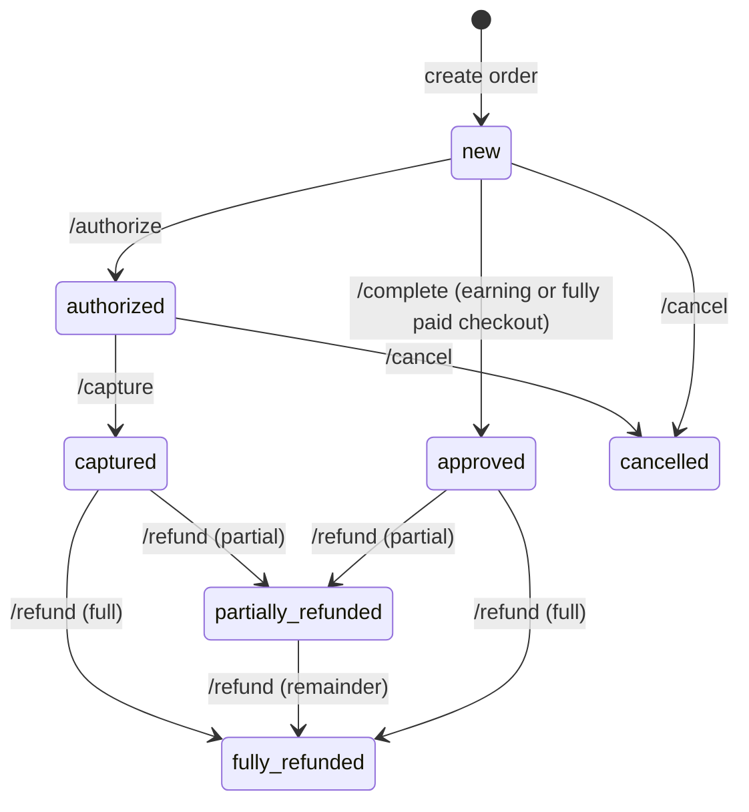

Every Points order moves through a small set of states, driven by either merchant API calls or internal Points events. Understanding the state machine is essential for building a correct refund / fulfilment / reconciliation pipeline.

This page is the single source of truth for:

- the **financial state machine** (`order_status`)
- the **shipping status** field and its bilingual custom labels
- which **webhook** fires on each transition

## The state machine


```mermaid
stateDiagram-v2
    [*] --> new: create order
    new --> approved: /complete (earning or fully paid checkout)
    new --> authorized: /authorize
    authorized --> captured: /capture
    authorized --> cancelled: /cancel
    captured --> fully_refunded: /refund (full)
    captured --> partially_refunded: /refund (partial)
    partially_refunded --> fully_refunded: /refund (remainder)
    approved --> fully_refunded: /refund (full)
    approved --> partially_refunded: /refund (partial)
    new --> cancelled: /cancel
```

## Financial statuses (`order_status`)

| Value | Meaning | Typical trigger |
| --- | --- | --- |
| `new` | Order created, not yet settled. Customer may still be on checkout. | `POST /orders/checkout/{publicKey}` or `POST /orders/earning` (pre-lock release). |
| `approved` | Order settled. Points credited or redeemed. Happy-path terminal state for earning and fully-paid checkouts. | `POST /orders/{uuid}/complete` (after payment) or the earning path on `POST /orders/earning`. |
| `authorized` | Funds reserved but not captured. Used when your PSP runs a two-step auth→capture flow. | `POST /orders/{uuid}/authorize`. |
| `captured` | Authorized funds captured. Terminal state before any refund. | `POST /orders/{uuid}/capture`. |
| `cancelled` | Order cancelled. Any reserved points are released back to the customer. | `POST /orders/{uuid}/cancel`. |
| `fully_refunded` | Full amount refunded. All redeemed points returned; earned points reversed. | `POST /orders/{uuid}/refund` (no `amount`, or amount equals total). |
| `partially_refunded` | A portion of the order refunded. | `POST /orders/{uuid}/refund` with a partial `amount`. |

<Note>
  `order_status` is a string enum in every webhook payload. The OpenAPI spec reflects a legacy numeric field — prefer the string values above.
</Note>

## Two order types

| `type` (numeric) | `type` (webhook string) | Description |
| --- | --- | --- |
| `1` | `earning` | Single-step order created via `POST /orders/earning` (or the rating-earning endpoints). Awards points on an event the customer has already completed on your side. |
| `2` | `replacing` | Full Points checkout — customer redeems + pays remainder on `business.papp.sa`. |

The state machine above applies to both, but earning orders typically move `new → approved` in a single step with no intermediate `authorized` / `captured`.

## Shipping status (separate field)

`order_status` tracks the **financial** state of the order. Physical-goods orders also have a separate **shipping status** that you update as you fulfil:

| Shipping status | Meaning |
| --- | --- |
| `new` | Order received, not yet processed. |
| `license_in_progress` | Paperwork / licensing in progress (where applicable). |
| `ready_shipping` | Packaged, handed to carrier. |
| `delivery_is_in_progress` | In transit. |
| `delivered` | Received by customer. |
| `cancelled` | Shipping cancelled (not the same as a financial cancellation). |

Update with `POST /v1/orders/{uuid}/status`. Each call fires a `shipping_status_updated` webhook.

<Note>
  Keep shipping status separate from financial status in your own system. `order_status` tells you whether the order was approved, captured, cancelled, or refunded; `status` tells you where fulfilment stands.
</Note>

## Custom shipping labels

Different fulfilment platforms (Salla, Zid, custom WMS, …) use status names that don't map cleanly onto the six built-in shipping stages above. `POST /v1/orders/{uuid}/status` accepts **two optional fields** alongside the canonical `status` enum so you can attach your own bilingual label to an order without us having to extend the enum:

| Field | Required? | Notes |
| --- | --- | --- |
| `status` | optional* | One of the canonical enum values listed above. Updates the canonical `status` column + fires the `shipping_status_updated` webhook. |
| `name_ar` | optional* | Free-form Arabic label, up to 120 chars. Stored on `custom_status.ar`. |
| `name_en` | optional* | Free-form English label, up to 120 chars. Stored on `custom_status.en`. |

<Note>
  *At least **one** of `status`, `name_ar`, or `name_en` must be supplied — a fully blank payload returns `422`. All three can be sent together; the canonical enum and the custom label update atomically.
</Note>

### Auto-translation

When only one of `name_ar` / `name_en` is supplied, the missing locale is auto-filled via Google Translate so `custom_status` always has both locales. Translations are cached server-side for 30 days keyed on `(target, text)` — sending the same label across 100 orders only hits Google once.

If the translator is unreachable (quota / network), the supplied locale is copied into the missing slot rather than leaving the row half-populated.

### Examples

<CodeGroup>
```bash Arabic only (auto-translates to English)
curl -X POST https://business.papp.sa/api/v1/orders/{uuid}/status \
  -H "x-api-key: $POINTS_PRIVATE_KEY" \
  -H "Content-Type: application/json" \
  -d '{"name_ar":"خرج للتوصيل"}'
```

```bash Both locales (no translation)
curl -X POST https://business.papp.sa/api/v1/orders/{uuid}/status \
  -H "x-api-key: $POINTS_PRIVATE_KEY" \
  -H "Content-Type: application/json" \
  -d '{
    "name_ar":"خرج للتوصيل",
    "name_en":"Out for delivery"
  }'
```

```bash Enum + custom label together
curl -X POST https://business.papp.sa/api/v1/orders/{uuid}/status \
  -H "x-api-key: $POINTS_PRIVATE_KEY" \
  -H "Content-Type: application/json" \
  -d '{
    "status":"delivery_is_in_progress",
    "name_ar":"خرج للتوصيل",
    "name_en":"Out for delivery"
  }'
```
</CodeGroup>

### Response fields

Every `Order` response exposes the resolved label so consumers don't have to duplicate the fallback logic client-side:

| Field | Type | Description |
| --- | --- | --- |
| `status` | `string` | Canonical enum value (`new` / `license_in_progress` / …). |
| `status_label` | `string` | Resolved display label — prefers `custom_status[<current locale>]` when set, falls back to the enum label otherwise. **Render this directly.** |
| `custom_status` | `object \| null` | `{ ar, en }` pair when the merchant has set a custom label; `null` otherwise. Useful for multi-locale clients that switch language without refetching. |

```json
{
  "id": 1042,
  "uuid": "550e8400-e29b-41d4-a716-446655440000",
  "status": "delivery_is_in_progress",
  "status_label": "خرج للتوصيل",
  "custom_status": {
    "ar": "خرج للتوصيل",
    "en": "Out for delivery"
  }
}
```

<Tip>
  Prefer `status_label` over `custom_status` + manual fallback. The label is locale-aware (respects the request's `Accept-Language` header / `?lang=` parameter) and stays in sync with the resolution logic on our side.
</Tip>

## Timeline example — redeem checkout with full refund

1. Customer clicks **Pay** → you call `POST /orders/checkout/{publicKey}` → order is `new`.
2. Customer completes payment on `business.papp.sa` → order transitions to `approved`, webhook `approved` fires.
3. 7 days later, customer requests a refund → you call `POST /orders/{uuid}/refund` → order moves to `fully_refunded`, redeemed points are returned, earned points reversed.

## Timeline example — authorize-capture flow

1. `POST /orders/checkout/{publicKey}` → order is `new`.
2. `POST /orders/{uuid}/authorize` after your PSP authorises → `authorized`.
3. `POST /orders/{uuid}/capture` after you ship → `captured`.
4. Later: partial refund for one returned item → `POST /orders/{uuid}/refund` with `amount` → `partially_refunded`.

## Invalid transitions

The API enforces the state machine. Examples that return `400`:

- `POST /orders/{uuid}/authorize` on a `cancelled` or already-refunded order.
- `POST /orders/{uuid}/capture` on an order that is not `authorized`.
- `POST /orders/{uuid}/refund` on an order that has not yet been `approved` or `captured`, or outside the allowed refund window.
- `POST /orders/{uuid}/complete` on an order that is already `approved` / `captured`.

Always check the response `message` field for the specific reason before retrying.

## Webhooks per transition

| Transition | Event delivered |
| --- | --- |
| `new → approved` (earning or complete) | `approved` (then also `completed` for replacing orders that hit the complete endpoint) |
| `new → authorized` | `authorized` |
| `authorized → captured` | `captured` |
| any → `cancelled` | `cancelled` |
| any → `fully_refunded` / `partially_refunded` | (handled by PSP/refund integration) |
| shipping status change | `shipping_status_updated` |

See [Webhook events](/webhooks/events) for payload schemas.

## Practical advice

<AccordionGroup>
  <Accordion title="Store the UUID, not the numeric ID">
    All endpoints take `{order:uuid}` — the integer `id` is internal and may change between environments.
  </Accordion>
  <Accordion title="Reconcile nightly against GET /orders/{uuid}">
    Don't rely solely on webhooks. Run a nightly job that fetches the authoritative state of any order you believe is still live, to catch the rare missed delivery.
  </Accordion>
  <Accordion title="Refunds reverse earned points too">
    A full refund returns redeemed points to the customer **and** reverses points earned on the refunded portion. Mirror this in your own loyalty calculations if you double-book rewards.
  </Accordion>
  <Accordion title="Cancellation vs refund">
    Cancel only while the order is `new` or `authorized`. Once funds are `captured` or the order is `approved`, use refund instead.
  </Accordion>
</AccordionGroup>

## Next

<CardGroup cols={2}>
  <Card title="Refunds & cancellations" icon="rotate-left" href="/integration/refunds-cancellations">
    Rules, windows, and partial refund behaviour.
  </Card>
  <Card title="Webhook events" icon="bell" href="/webhooks/events">
    Per-event payload schemas and sample bodies.
  </Card>
</CardGroup>
