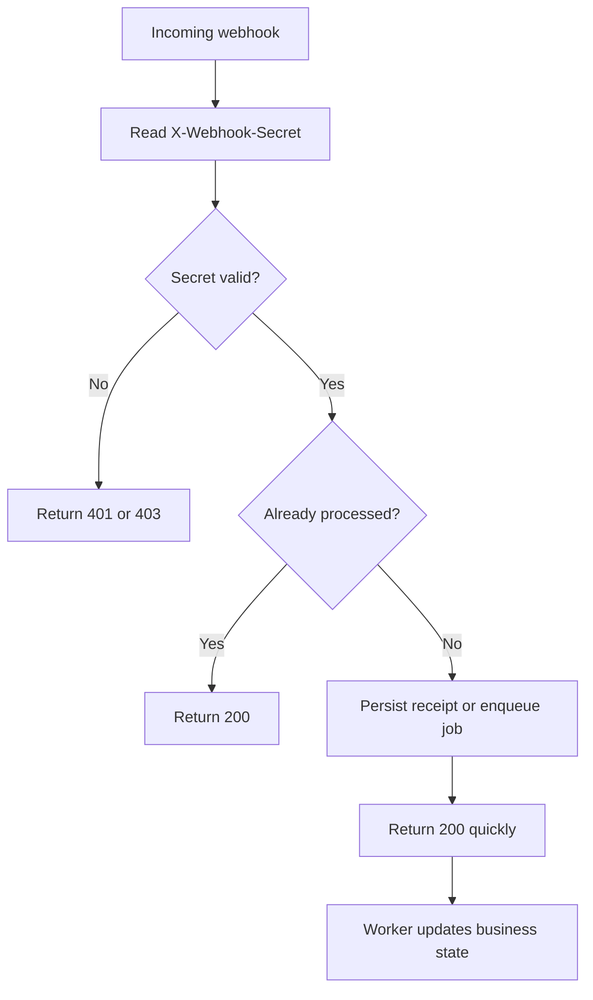

This page shows the recommended webhook consumer pattern for Points.

## Golden rules

1. verify `X-Webhook-Secret`
2. acknowledge quickly with `2xx`
3. enqueue work instead of processing inline
4. deduplicate on `(order.id, event)`

## Expected request

Points sends:

```http
POST /your-webhook-endpoint HTTP/1.1
Content-Type: application/json
X-Webhook-Secret: abc123def456...
X-Webhook-Event: approved
```

With a JSON body like:

```json
{
  "event": "approved",
  "order": {
    "id": "550e8400-e29b-41d4-a716-446655440000",
    "order_number": "ORD-2024-0001",
    "order_status": "approved"
  },
  "timestamp": "2026-04-18T10:05:12Z"
}
```

## Recommended handling sequence



## Verification example

### Node.js

```javascript
import crypto from "node:crypto";

function verifySecret(received, expected) {
  const a = Buffer.from(received || "", "utf8");
  const b = Buffer.from(expected || "", "utf8");
  if (a.length !== b.length) return false;
  return crypto.timingSafeEqual(a, b);
}
```

### PHP

```php
if (!hash_equals($expectedSecret, (string) request()->header('X-Webhook-Secret'))) {
    abort(401);
}
```

### Python

```python
import hmac

if not hmac.compare_digest(received_secret or "", expected_secret or ""):
    raise PermissionError("Invalid webhook secret")
```

## Fast-ack pattern

Do this:

```javascript
app.post("/webhooks/points", async (req, res) => {
  if (!verifySecret(req.header("X-Webhook-Secret"), process.env.POINTS_WEBHOOK_SECRET)) {
    return res.status(401).end();
  }

  await queue.publish("points.webhook", req.body);
  return res.status(200).end();
});
```

Do not:

- call slow third-party services before responding
- send email synchronously
- update ERP/WMS inline if it can block the response

## Idempotency strategy

Deduplicate using:

- `order.id`
- `event`

Recommended database uniqueness rule:

```sql
create unique index points_webhook_event_dedupe
  on webhook_events (points_order_uuid, event);
```

If a duplicate arrives, return `200` and do nothing.

## Status codes

| Your response | Meaning |
| --- | --- |
| `200` / `204` | Accepted |
| `401` / `403` | Secret invalid |
| `5xx` | Temporary processing failure; may trigger retry |

## Retry expectations

Current backend behavior:

- each outbound request uses a `10` second timeout
- the job retries up to `3` times on failure

Your side should therefore assume duplicates are normal.

## Operational tips

<AccordionGroup>
  <Accordion title="Log verification failures separately">
    A sudden wave of secret mismatches often means the secret was rotated on one side only, or the endpoint was copied incorrectly.
  </Accordion>
  <Accordion title="Persist raw payload for audit">
    Store the raw JSON and headers for a limited retention period in staging/production so support can reconcile difficult cases.
  </Accordion>
  <Accordion title="Use one secret per environment">
    Never reuse production webhook secrets in staging or local development.
  </Accordion>
</AccordionGroup>

See [Security](/authentication/security#webhook-security) for broader hardening guidance, and [Webhook events](/webhooks/events) for payload schemas.
