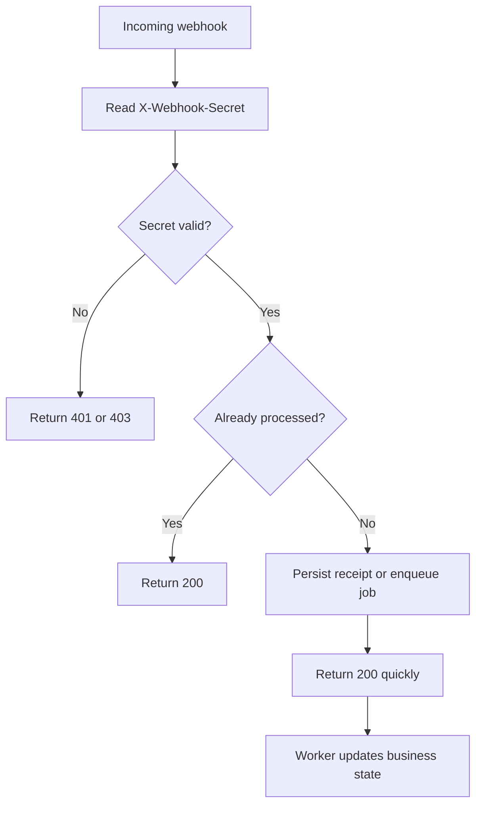

Webhooks are how Points tells **your backend** that something happened — an order was approved, a refund was issued, a shipping status changed. You register one or more HTTPS endpoints; Points posts JSON to them whenever an event fires.

Webhooks are the **source of truth** for order state on your side. Poll-based reconciliation is a safety net, not the primary path.

## When webhooks fire

| Event | Fired when |
| --- | --- |
| `approved` | Order completes and points are settled |
| `authorized` | Funds authorised (auth+capture PSPs) |
| `captured` | Previously authorised funds captured |
| `cancelled` | Order cancelled |
| `completed` | Replacing order completed via `POST /orders/{uuid}/complete` |
| `refunded` | Full or partial refund processed |
| `auto_refunded` | Internal automatic reversal performed by Points |
| `shipping_status_updated` | Shipping status changed via `POST /orders/{uuid}/status` |

Full payload schemas in [Webhook events](/webhooks/events).

## Delivery mechanics

- **Transport** — HTTPS POST, `Content-Type: application/json`.
- **Timeout** — 10 seconds per attempt.
- **Retries** — up to 3 attempts on transient failure (non-2xx response, network error, timeout).
- **Delivery order** — not guaranteed. Your handler must be idempotent (see below).
- **Headers:**

| Header | Value |
| --- | --- |
| `Content-Type` | `application/json` |
| `X-Webhook-Secret` | The secret you registered with the webhook (use this to verify authenticity) |
| `X-Webhook-Event` | Event name (e.g. `approved`). Same value as `event` in the body. |

## Payload shape

Every event has the same envelope:

```json
{
  "event": "approved",
  "order": {
    "id": "550e8400-e29b-41d4-a716-446655440000",
    "reference_number": "REF-2024-001234",
    "order_number": "ORD-2024-0001",
    "type": "replacing",
    "total_price": 150.75,
    "total_points": 500,
    "payment_status": "fully_paid",
    "order_status": "approved",
    "metadata": { "source": "web" },
    "created_at": "2026-04-18T10:00:00Z",
    "updated_at": "2026-04-18T10:05:12Z"
  },
  "timestamp": "2026-04-18T10:05:12Z"
}
```

Some events include additional keys inside `order` (e.g. `status` + `status_label` for `shipping_status_updated`). See [Webhook events](/webhooks/events) for per-event fields.

## Register a webhook

Use the API, or the dashboard (**Settings → Webhooks**). Example:

```bash
curl -X POST https://business.papp.sa/api/v1/webhooks \
  -H "x-api-key: $POINTS_API_KEY" \
  -H "Content-Type: application/json" \
  -d '{
    "name": "Order Notifications",
    "url":  "https://merchant.example.com/webhooks/points"
  }'
```

Response:

```json
{
  "data": {
    "uuid": "550e8400-e29b-41d4-a716-446655440000",
    "merchant_id": 123,
    "name": "Order Notifications",
    "url": "https://merchant.example.com/webhooks/points",
    "secret": "abc123def456...",
    "created_at": "2026-04-18T10:00:00Z",
    "updated_at": "2026-04-18T10:00:00Z"
  }
}
```

<Warning>
  Store the `secret` securely — it is how you verify webhook authenticity (see below).
</Warning>

See [Webhook management](/webhooks/management) for listing, updating, and deleting webhooks.

## Multiple endpoints

You can register more than one webhook per merchant. Common reasons:

- Separate environments (staging vs production).
- Separate downstream consumers (fulfilment, analytics, CRM).
- A "dead-letter inspector" endpoint that only logs for audit.

Every registered webhook receives **every** event for your merchant. Filtering is your responsibility.

---

## Handling webhooks

The recommended consumer pattern boils down to four rules:

1. verify `X-Webhook-Secret`
2. acknowledge quickly with `2xx`
3. enqueue work instead of processing inline
4. deduplicate on `(order.id, event)`

### Recommended handling sequence



### Verifying the secret

Use a constant-time comparison so you don't leak timing information.

<CodeGroup>
```javascript Node.js
import crypto from "node:crypto";

function verifySecret(received, expected) {
  const a = Buffer.from(received || "", "utf8");
  const b = Buffer.from(expected || "", "utf8");
  if (a.length !== b.length) return false;
  return crypto.timingSafeEqual(a, b);
}
```

```php PHP
if (!hash_equals($expectedSecret, (string) request()->header('X-Webhook-Secret'))) {
    abort(401);
}
```

```python Python
import hmac

if not hmac.compare_digest(received_secret or "", expected_secret or ""):
    raise PermissionError("Invalid webhook secret")
```
</CodeGroup>

### Fast-ack pattern

Your endpoint **must** respond 2xx within the 10-second timeout budget. Anything slower triggers a retry, which leads to duplicates. Do this:

```javascript
app.post("/webhooks/points", async (req, res) => {
  if (!verifySecret(req.header("X-Webhook-Secret"), process.env.POINTS_WEBHOOK_SECRET)) {
    return res.status(401).end();
  }

  await queue.publish("points.webhook", req.body); // enqueue
  return res.status(200).end();                    // ack immediately
});
```

Do **not**:

- call slow third-party services before responding
- send email synchronously
- update ERP/WMS inline if it can block the response

Your worker pulls from the queue and does the real work (update DB, send email, notify WMS). If the worker fails, it can retry locally without Points re-delivering.

### Idempotency strategy

Points may deliver the same `(order.id, event)` pair more than once — retry loops, backend replays, network blips. Design your handler so repeat deliveries are safe.

Recommended database uniqueness rule:

```sql
create unique index points_webhook_event_dedupe
  on webhook_events (points_order_uuid, event);
```

Or in application code:

```javascript
const existed = await db.webhookEvents.findOne({
  where: { orderUuid: payload.order.id, event: payload.event }
});
if (existed) return res.status(200).end(); // ack, already processed
```

If a duplicate arrives, return `200` and do nothing.

### Status codes

| Your response | Meaning |
| --- | --- |
| `200` / `204` | Accepted |
| `401` / `403` | Secret invalid |
| `5xx` | Temporary processing failure; may trigger retry |

### Retry expectations

Current backend behavior:

- each outbound request uses a `10` second timeout
- the job retries up to `3` times on failure

Your side should therefore assume duplicates are normal.

## Local development

Webhooks need a publicly reachable HTTPS URL. In local dev, tunnel your laptop to the internet:

- [ngrok](https://ngrok.com/) — `ngrok http 3000`
- [Cloudflare Tunnel](https://developers.cloudflare.com/cloudflare-one/connections/connect-networks/) — `cloudflared tunnel --url http://localhost:3000`
- [localtunnel](https://github.com/localtunnel/localtunnel) — `lt --port 3000`

Register the tunnel URL as a webhook in the sandbox environment and trigger test events by calling the API against a sandbox order.

## Operational tips

<AccordionGroup>
  <Accordion title="Log verification failures separately">
    A sudden wave of secret mismatches often means the secret was rotated on one side only, or the endpoint was copied incorrectly.
  </Accordion>
  <Accordion title="Persist raw payload for audit">
    Store the raw JSON and headers for a limited retention period in staging/production so support can reconcile difficult cases.
  </Accordion>
  <Accordion title="Use one secret per environment">
    Never reuse production webhook secrets in staging or local development.
  </Accordion>
</AccordionGroup>

See [Security](/authentication/security#webhook-security) for broader hardening guidance.

## Next

<CardGroup cols={2}>
  <Card title="Webhook events" icon="list" href="/webhooks/events">
    Per-event payload schemas and sample bodies.
  </Card>
  <Card title="Webhook management" icon="gear" href="/webhooks/management">
    CRUD operations via API or dashboard.
  </Card>
</CardGroup>
